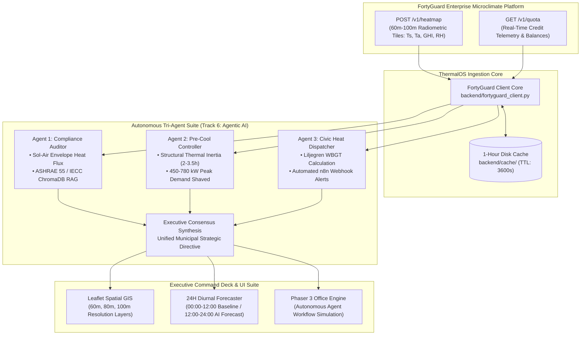

<div align="center">

# 🌡️ ThermalOS
### **Autonomous Multi-Agent Urban Thermal Operating System**
*Powered by FortyGuard's Enterprise Microclimate API*

<br/>

[](https://fortyguard.com)
[](https://fastapi.tiangolo.com)
[](https://react.dev)
[](https://vitejs.dev)
[](https://tailwindcss.com)
[](https://www.trychroma.com)
[](https://phaser.io)
[](https://leafletjs.com)
[](backend/test_suite.py)
[](LICENSE)

<br/>

[API Integration Guide](FORTYGUARD_API_DOCUMENTATION.md) • [Backend Test Suite](backend/test_suite.py) • [Architecture Overview](#-system-architecture)

---

</div>

## 📌 Executive Overview

Extreme urban heat is the deadliest and fastest-growing climate risk, causing over 1,300 annual fatalities in the United States alone and pushing regional power grids into catastrophic chiller-driven brownouts. Conventional meteorological stations are spaced **10km+ apart**, completely blinding city administrators to hyper-local street canyon heat traps, asphalt radiation reservoirs, and rapid building envelope insulation degradation.

**ThermalOS** is an autonomous multi-agent operating system that fuses **FortyGuard's street-level radiometric microclimate API** ($60\text{m}–100\text{m}$ resolution) with thermodynamic physics modeling and autonomous AI agents. ThermalOS transforms passive weather telemetry into predictive, automated municipal and infrastructure interventions.

---

## 🏛️ System Architecture



---

## 🤖 The Tri-Agent Autonomous Suite (Track 6: Agentic AI)

ThermalOS deploys three specialized autonomous agents coordinated by an Executive Consensus Synthesis engine:

### 1. Agent 1 — Energy & Thermal Compliance Auditor ([`agent1_rag_auditor.py`](backend/agent1_rag_auditor.py))
* **Thermodynamic Sol-Air Physics**: Ingests FortyGuard surface radiometry ($T_s$) and global horizontal solar irradiance ($\text{GHI}$) to compute sol-air envelope heat flux:
  $$T_{\text{sol-air}} = T_a + \frac{\alpha \cdot \text{GHI}}{h_o} - \frac{\varepsilon \cdot \Delta R}{h_o}$$
* **Vector RAG Standards**: Executes semantic vector searches across embedded **ASHRAE 55-2023** and **IECC 2024** building energy standards stored in ChromaDB.
* **Measurable Output**: Detects real-time envelope insulation $R$-value derating up to **35%**, flagging HVAC over-sizing risks.

### 2. Agent 2 — Infrastructure & HVAC Pre-Cool Controller ([`agent2_precool_controller.py`](backend/agent2_precool_controller.py))
* **Thermal Inertia Simulation**: Models structural concrete mass heat storage lag ($2.0–3.5\text{ hours}$).
* **MPC Load-Shifting**: Shifts municipal chiller power consumption to off-peak morning hours ($03:00–07:00$), before peak solar zenith stress ($13:00–17:00$).
* **Measurable Output**: Shaves **$450–780\text{ kW}$ (25–40%)** in peak electrical demand, preventing grid transformer burnout.

### 3. Agent 3 — Civic & Public Health Heat Dispatcher ([`agent3_dispatcher.py`](backend/agent3_dispatcher.py))
* **Liljegren Wet-Bulb Globe Temperature (WBGT)**: Fuses FortyGuard relative humidity, solar flux, and air temperature into thermodynamic heat stress indexes:
  $$\text{Vapor Pressure } (e) = \frac{\text{RH}}{100} \cdot 6.105 \cdot \exp\left(\frac{17.27 \cdot T_a}{237.7 + T_a}\right)$$
  $$\text{WBGT} \approx 0.567 \cdot T_a + 0.393 \cdot e + 3.94 + f(\text{GHI})$$
* **Automated Emergency Dispatch**: When $\text{WBGT} > 85.0^\circ\text{F}$, automatically fires high-priority **n8n webhooks** to dispatch municipal hydration units, open cooling shelters, and enforce **OSHA/ACGIH 15 min/hr** outdoor work/rest limits.

---

## 🖥️ Executive Interface & Visualization Suite

| Component | Technology | Description |
| :--- | :--- | :--- |
| **Spatial GIS Heatmap** | Leaflet + GeoJSON | Interactive GIS map displaying street-level radiometric tiles with **60m, 80m, and 100m resolution** toggles and dual satellite basemaps. |
| **24H Diurnal Forecaster** | Chart.js + Tailwind | Physics-based 24-hour timeline scrubber modeling **00:00–12:00 historical baseline** and **12:00–24:00 predictive AI forecast**, highlighting thermal pre-cooling and peak stress windows. |
| **Phaser 3 Office Simulation** | Phaser 3 Canvas | Real-time 2D simulation visualizing autonomous agent workflows, door badge access, and command desk interactions. |
| **Dual-Mode Fluid UI** | Tailwind + Glassmorphism | Apple-grade Glassmorphic interface supporting both high-contrast Dark Mode and sleek Light Mode with monospace number stabilization. |

---

## 📡 FortyGuard API Integration & Smart Caching

* **Core Client**: [`backend/fortyguard_client.py`](backend/fortyguard_client.py)
* **Endpoints Ingested**:
  * `POST https://api.fortyguard.com/v1/heatmap`: Street-level raster radiometry, GHI, and ambient conditions.
  * `POST /v1/system/fetch-api-key-usage` & `GET /v1/quota`: Real-time cloud credit balance tracking.
* **Persistent 1-Hour Disk Cache**: Implements an automated disk cache (`backend/cache/`) keyed by area and timestamp hash with a 3600-second TTL to guarantee zero quota exhaustion during high-concurrency evaluation (adhering strictly to §7.7 of the FortyGuard Handbook).

For detailed documentation, endpoints, and schema definitions, see [`FORTYGUARD_API_DOCUMENTATION.md`](FORTYGUARD_API_DOCUMENTATION.md).

---

## 🚀 Quickstart & Setup Guide

### Prerequisites
* **Node.js**: v18.0.0 or higher
* **Python**: v3.10 or higher
* **Git**

### 1. Clone the Repository
```bash
git clone https://github.com/MuhammadUsman-Khan/ThermalOS.git
cd ThermalOS
```

### 2. Backend Setup
```bash
# Navigate to backend and create virtual environment
cd backend
python -m venv venv

# Activate virtual environment
# Windows:
venv\Scripts\activate
# Linux/macOS:
source venv/bin/activate

# Install dependencies
pip install -r requirements.txt

# Configure environment variables
cp .env.example .env
# Edit .env and add your FORTYGUARD_API_KEY=your_key_here

# Launch the FastAPI server (Port 8000)
python mock_api.py
```

### 3. Frontend Setup
```bash
# Open a new terminal and navigate to frontend
cd frontend

# Install dependencies
npm install

# Start the Vite development server (Port 5173)
npm run dev
```

### 4. Running the Backend Test Suite
```bash
cd backend
python test_suite.py
```

---

## 📁 Repository Structure

```
ThermalOS/
├── backend/
│   ├── agent1_rag_auditor.py       # ASHRAE 55 Sol-Air RAG Vector Auditor
│   ├── agent2_precool_controller.py# Building Thermal Inertia Chiller MPC
│   ├── agent3_dispatcher.py        # Liljegren WBGT & n8n Emergency Dispatcher
│   ├── fortyguard_client.py        # FortyGuard Enterprise SDK & 1-Hour Cache
│   ├── mock_api.py                 # FastAPI Telemetry & Orchestration Engine
│   ├── test_suite.py               # Comprehensive Backend Unit Tests
│   ├── requirements.txt            # Python Dependencies
│   └── .env.example                # Environment Variable Template
├── frontend/
│   ├── src/
│   │   ├── components/
│   │   │   ├── AgentVisualization.jsx      # Phaser 3 Live Office Canvas
│   │   │   ├── SpatialHeatmapView.jsx      # Leaflet GIS 60m-100m Microclimate Layer
│   │   │   ├── DiurnalTimelineScrubber.jsx # 24H Physics Timeline Scrubber
│   │   │   ├── AgentOneModal.jsx           # Compliance Audit Details Modal
│   │   │   ├── AgentTwoModal.jsx           # Pre-Cool MPC Details Modal
│   │   │   ├── AgentThreeModal.jsx         # Civic Alert Dispatch Details Modal
│   │   │   └── ExecutiveSynthesisModal.jsx # Tri-Agent Consensus Modal
│   │   ├── App.jsx                         # Main Executive Dashboard
│   │   └── index.css                       # Apple Frosted Glass Design System
│   ├── package.json
│   └── vite.config.js
├── FORTYGUARD_API_DOCUMENTATION.md # Detailed FortyGuard API Technical Guide
├── README.md                       # Master Architecture & Project Documentation
└── LICENSE                         # MIT License
```

---

## 📜 License
This project is licensed under the MIT License — see the [LICENSE](LICENSE) file for details.
