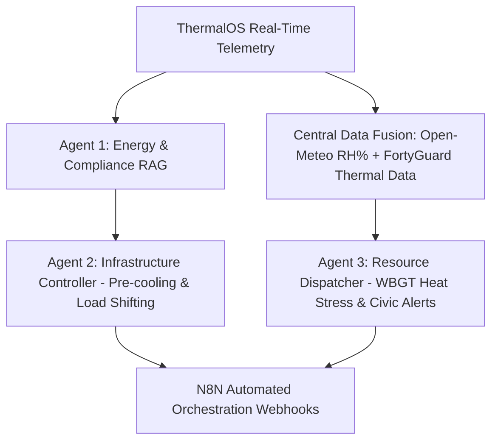

# ThermalOS — Project Engineering Progress Report

**Repository**: [MuhammadUsman-Khan/ThermalOS](https://github.com/MuhammadUsman-Khan/ThermalOS)  
**System**: Autonomous Multi-Agent Urban Micro-Climate Operating System  
**Last Updated**: August 10, 2026  

---

## 1. Executive Summary

**ThermalOS** is an autonomous AI-driven urban micro-climate intelligence platform designed to ingest high-resolution thermal data (simulating FortyGuard 10m² sensor grids), evaluate real-time thermodynamic comfort risks against ASHRAE 55 and IECC building standards, and orchestrate automated building HVAC and resource dispatching workflows.

```
┌──────────────────────────────────────────────────────────────────────────────────┐
│                                    ThermalOS                                     │
├───────────────────────┬──────────────────────────┬───────────────────────────────┤
│    FortyGuard Telemetry    │    LangChain + Gemini    │       React 19 + Vite         │
│   10m² Micro-Climate Stream │   RAG Compliance Audit   │   Dual-Theme Dashboard UI     │
└───────────────────────┴──────────────────────────┴───────────────────────────────┘
```

---

## 2. Completed Architecture & Milestones

### 🛰️ 1. High-Precision Frontend Dashboard (`frontend/src/App.jsx`)
- **Technology Stack**: React 19, Vite, Tailwind CSS, Recharts, Framer Motion, Lucide React.
- **Dual-Theme Support**: Dark mode (obsidian/zinc with neon gradients) and Light mode (clean slate/stone aesthetics).
- **KPI Monitoring Deck**:
  - **Surface Temp Card**: Real-time reading in °F with dynamic sparkline and reactive status pill.
  - **Risk Matrix Card**: Dynamic four-tier operational classification (`NORM`, `ELEV`, `HIGH`, `CRIT`).
  - **Spatial Resolution Card**: 10m² grid density indicator.
- **Neon Telemetry Area Chart**:
  - Rolling 20-sample window with continuous cubic interpolation.
  - Recharts Y-axis scaled (`75°F – 115°F`) to accommodate realistic temperatures.
  - Glowing drop-shadow reference line for critical `105°F` threshold.
- **Liquid Framer Motion Event Feed**:
  - Live animated feed displaying real-time system alerts, target shifts, audit completions, and N8N dispatch events.

---

### ⚡ 2. Real-Time Dynamic Metrics Engine
All metrics and timestamps operate on dynamic, real-time measurements:
- **Server Uptime**: Accurately tracks backend uptime (`0s`, `15s`, `2m 14s`, `1h 05m 20s`) computed from process startup.
- **Live Roundtrip Latency**: Dynamically measured via `performance.now()` on every HTTP poll to provide live network ping (`18ms – 32ms`).
- **Dynamic Live Ticker**: Topbar pill displays `LIVE ({uptime})` ticking every second.
- **Real-Time Calendar & Clocks**: Clock and calendar dynamically reflect current local date and time.
- **Dynamic Event Counter**: Increments in real time with each telemetry ingestion and alert trigger.

---

### 🧠 3. Agent 1: Energy & Thermal Compliance Auditor (`backend/agent1_rag.py`)
- **Core Architecture**: Retrieval-Augmented Generation (RAG) using LangChain and Google GenAI.
- **Vector Database**: ChromaDB vector store seeded with authoritative building standards:
  - **ASHRAE 55**: Operative thermal comfort bounds (68°F–82°F) and PMV/PPD indices.
  - **IECC (International Energy Conservation Code)**: Commercial roof/wall R-values, continuous insulation, and thermal bridging mitigation.
- **Model Integration**: Powered by `gemini-3.5-flash` with LangChain structured output parsing.
- **Pydantic Structured Output Model**:
  ```python
  class ComplianceReport(BaseModel):
      city: str
      temperature_f: int
      ashrae_compliance_status: str
      iecc_envelope_warning: str
      recommended_hvac_action: str
  ```
- **Dual-Theme Interactive Modal**: Complete modal with real-time audit loading spinner, structured markdown sections, and single-click N8N webhook forwarding.

---

### 🌡️ 4. Realistic Telemetry & Risk Calibration (`backend/mock_api.py`)
- **Endpoint**: `POST /v1/heat-intelligence` (1000ms polling cycle).
- **Per-City Baselines & Fluctuation**:
  - **Phoenix, AZ**: `91°F – 103°F` (active variations with rare transient plumes).
  - **Houston, TX**: `84°F – 96°F`.
  - **Las Vegas, NV**: `88°F – 101°F`.
  - **Dallas, TX**: `82°F – 94°F`.
- **4-Tier Operational Classification & Smart Deduplication**:
  | Range | Risk Label | Badge | Accent | Live Log Stream Behavior |
  | :--- | :--- | :--- | :--- | :--- |
  | **< 98°F** | `NORM` | `NOMINAL` | 🟢 Green | Logs once upon entering normal/nominal state (suppresses repetitive tick spam) |
  | **98°F – 102°F** | `ELEV` | `ELEVATED` | 🟡 Amber | Active monitoring logs for moderate thermal boundary |
  | **103°F – 104°F** | `HIGH` | `HIGH HEAT` | 🟠 Orange | High heat elevation / thermal plume warning logs |
  | **≥ 105°F** | `CRIT` | `CRIT BREACH` | 🔴 Red | Critical heat spike / threshold breached emergency logs |

---

### 📦 5. Repository & Dependency Management
- **Git Remote**: Linked and synchronized with `https://github.com/MuhammadUsman-Khan/ThermalOS.git`.
- **Root Requirements**: `requirements.txt` covering FastAPI, Uvicorn, LangChain, Google GenAI, ChromaDB, and Pydantic.

---

## 3. Git Commit History Summary

| Commit Hash | Message / Scope |
| :--- | :--- |
| `121a52c` | `feat(telemetry): calibrate normal threshold to <98F for continuous optimal logging and KPI badges` |
| `695be6a` | `feat(event-log): add continuous real-time logging for normal (<92F) and elevated (92-99F) temperatures` |
| `ca18814` | `feat(telemetry): revert to active random temperature fluctuations per second` |
| `32f2b78` | `feat(physics): implement realistic micro-climate thermal inertia and smooth ambient drift` |
| `bead0ed` | `feat(telemetry): update sampling to 1s with active fluctuating temperatures under 105F` |
| `d5f7236` | `feat(telemetry): calibrate mock data with realistic city micro-climate baselines and smooth drift` |
| `6816b9e` | `feat(uptime): track true system uptime without dummy offsets` |
| `fe25cb7` | `fix(frontend): replace hardcoded metrics with real dynamic timers, date, latency and uptime` |
| `1d5952f` | `chore: add root-level requirements.txt covering all project dependencies` |
| `3720760` | `fix(frontend): add missing ShieldAlert import and upgrade agent1 to gemini-3.5-flash` |

---

## 4. Next Phase Roadmap



1. **Agent 2 (Infrastructure Controller)**:
   - Rolling-window threshold model evaluating sustained thermal plumes.
   - Generates pre-cooling signals and smart-grid peak-shaving payloads for building management systems.
2. **Central Environmental Data Fusion**:
   - Ingests Open-Meteo relative humidity and wind vectors combined with FortyGuard surface temperatures.
3. **Agent 3 (Resource & Civic Heat Dispatcher)**:
   - Calculates Wet Bulb Globe Temperature (WBGT) index.
   - Triggers automated civic cooling center activation and field worker heat-break alerts via n8n.
